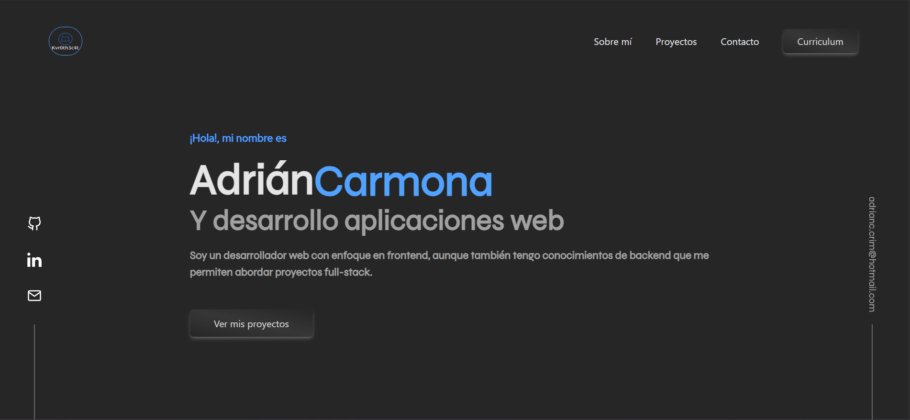
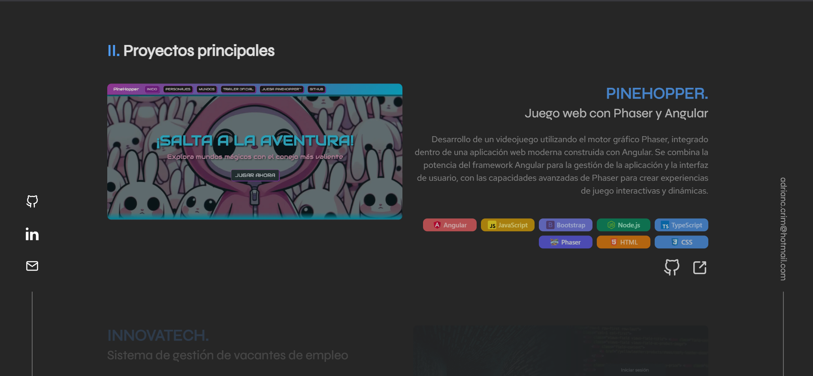

# Portfolio Personal - Adrián Carmona


## 📖 Descripción

**Portfolio Personal** es una aplicación web moderna que presenta mi trabajo, habilidades y experiencia como desarrollador Full Stack. Diseñado con una interfaz minimalista y animaciones fluidas, muestra mis proyectos más destacados, tecnologías dominadas y formas de contacto profesional.

## ✨ Características

- **Sección Hero** con presentación dinámica y texto rotativo
- **Sobre Mí** con información personal y profesional detallada
- **Proyectos destacados** con enlaces a demos y repositorios
- **Stack tecnológico** con badges interactivos de habilidades
- **Formulario de contacto** funcional para comunicación directa
- **CV descargable** en formato PDF
- **Animaciones fluidas** con Framer Motion y GSAP
- **Diseño responsive** optimizado para todos los dispositivos
- **Tipografías personalizadas** Red Hat Display y Syne
- **Sidebars informativos** con enlaces sociales y información adicional

## 🚀 Demo

**🔗 Demo en vivo:** [www.adriancc.com](www.adriancc.com)

## 📸 Capturas de pantalla

### Página Principal


### Secciones


## 🛠️ Tecnologías utilizadas

### Frontend
- **React:** 19.1.0
- **React DOM:** 19.1.0
- **HTML5, CSS3, JavaScript ES6+**

### Estilos & UI
- **Tailwind CSS:** 4.1.11
- **Fuentes:** Red Hat Display, Syne

### Animaciones
- **Framer Motion:** 12.23.11
- **GSAP:** 3.13.0

### Desarrollo & Build
- **Vite:** 7.0.4
- **ESLint:** 9.30.1

### Stack Tecnológico Mostrado
- **Frontend:** React, Angular, HTML5, CSS3, JavaScript, TypeScript
- **Backend:** Node.js, Java, Spring Framework
- **Bases de Datos:** MySQL
- **Herramientas:** Bootstrap, Tailwind CSS, Vite, Phaser

## 📋 Prerrequisitos

Antes de comenzar, asegúrate de tener instalado:

- [Node.js](https://nodejs.org/) (versión 16.0.0 o superior)
- [npm](https://www.npmjs.com/) 
- [Git](https://git-scm.com/)

## ⚙️ Instalación

1. **Clona el repositorio**
   ```bash
   git clone https://github.com/tuusuario/portfolio.git
   ```

2. **Navega al directorio del proyecto**
   ```bash
   cd portfolio
   ```

3. **Instala las dependencias**
   ```bash
   npm install
   ```

4. **Ejecuta la aplicación**
   ```bash
   npm run dev
   ```

5. **Abre tu navegador** y visita `http://localhost:5173`

## 🏗️ Estructura del proyecto

```
portfolio/
├── public/
│   ├── Profile.png
│   └── vite.svg
├── src/
│   ├── assets/
│   │   ├── docs/
│   │   ├── fonts/
│   │   └── img/
│   ├── components/
│   │   ├── layout/
│   │   │   ├── Contacto.jsx
│   │   │   ├── Footer.jsx
│   │   │   ├── Hero.jsx
│   │   │   ├── LeftSideBar.jsx
│   │   │   ├── Nav.jsx
│   │   │   ├── Proyectos.jsx
│   │   │   ├── RightSideBar.jsx
│   │   │   └── SobreMi.jsx
│   │   └── UI/
│   │       ├── Badges.jsx
│   │       ├── Button.jsx
│   │       └── RotatingText.jsx
│   ├── hooks/
│   │   ├── useBadges.jsx
│   │   ├── useFadeIn.jsx
│   │   └── useScrollTrigger.jsx
│   ├── App.jsx
│   ├── index.css
│   └── main.jsx
├── package.json
└── README.md
```

## 🔧 Scripts disponibles

```bash
npm run dev        # Ejecuta la app en modo desarrollo
npm run build      # Construye la app para producción
npm run preview    # Previsualiza la build de producción
npm run lint       # Ejecuta el linter
```

## 📱 Responsive Design

La aplicación está optimizada para:
- 📱 **Mobile** (320px+)
- 📟 **Tablet** (768px+)  
- 💻 **Desktop** (1024px+)
- 🖥️ **Large Desktop** (1440px+)

## 🎨 Diseño

### Paleta de colores
- **Base:** Gama de neutrals de Tailwind CSS
- **Estilo:** Moderno, minimalista y profesional

### Tipografía
- **Red Hat Display**: Títulos y elementos destacados
- **Syne**: Texto general y contenido

### Animaciones
- **Framer Motion**: Transiciones suaves entre secciones
- **GSAP**: Animaciones avanzadas y efectos visuales
- **Scroll Triggers**: Animaciones activadas por scroll

## 📂 Funcionalidades

### Implementadas ✅
- [x] Sección Hero con presentación dinámica
- [x] Texto rotativo con múltiples profesiones
- [x] Sección Sobre Mí con información detallada
- [x] Galería de proyectos con enlaces funcionales
- [x] Stack tecnológico con badges interactivos
- [x] Formulario de contacto funcional
- [x] CV descargable en PDF
- [x] Sidebars con información adicional
- [x] Enlaces a redes sociales
- [x] Navegación suave entre secciones
- [x] Animaciones de scroll
- [x] Diseño responsive completo
- [x] Optimización de rendimiento

### Proyectos destacados incluidos
- **spaceXInfo**: Aplicación web de información sobre SpaceX
- **PinneHopper**: Juego desarrollado en Phaser 
- **Innovatech**: Aplicación de gestión de vacantes

## 🚀 Deployment

Para deploy en producción:

1. Ejecuta `npm run build`
2. Los archivos se generan en la carpeta `dist/`
3. Sube el contenido a tu servidor web o plataforma de hosting

### Recomendaciones de hosting
- **Vercel** (recomendado para proyectos React)
- **Netlify** 
- **GitHub Pages**
- **VPS propio** con Apache/Nginx

## 🐛 Reportar problemas

Si encuentras algún bug o tienes sugerencias:

1. Verifica que no exista un issue similar
2. Crea un [nuevo issue](https://github.com/Kvr0th3c4t/portfolio/issues)
3. Proporciona toda la información relevante

## 📝 Licencia

Este proyecto está bajo la Licencia MIT - mira el archivo [LICENSE](LICENSE) para más detalles.

## 👨‍💻 Autor

**Adrián Carmona**
- GitHub: [@tuusuario](https://github.com/Kvr0th3c4t)
- LinkedIn: [Adrián Carmona](https://www.linkedin.com/in/adrián-carmonamad/)
- Email: adrianc.crim@hotmail.com

## 🙏 Agradecimientos

- [React](https://reactjs.org/) y [Vite](https://vitejs.dev/) por las herramientas de desarrollo
- [Tailwind CSS](https://tailwindcss.com/) por el framework de estilos
- [Framer Motion](https://www.framer.com/motion/) por las animaciones fluidas
- [GSAP](https://greensock.com/) por las animaciones avanzadas

## 📊 Estado del proyecto


---

⭐️ **¡No olvides darle una estrella al proyecto si te gustó!** ⭐️

> **Nota:** Este es mi portfolio personal donde muestro mis habilidades y proyectos como desarrollador Full Stack. Siempre abierto a nuevas oportunidades y colaboraciones.
